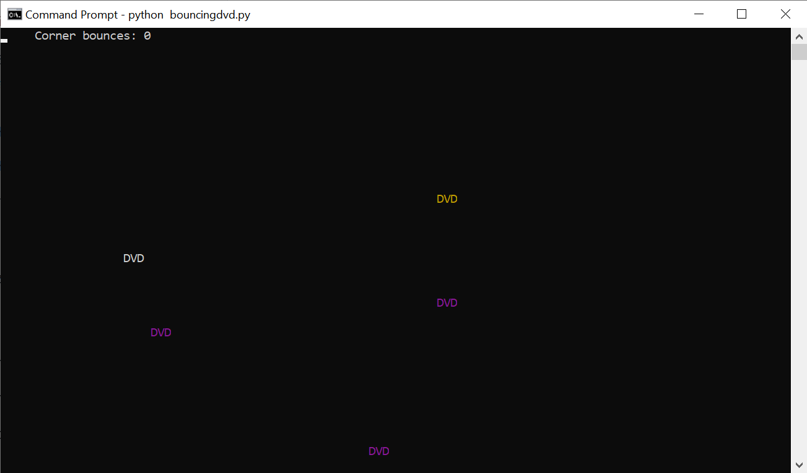
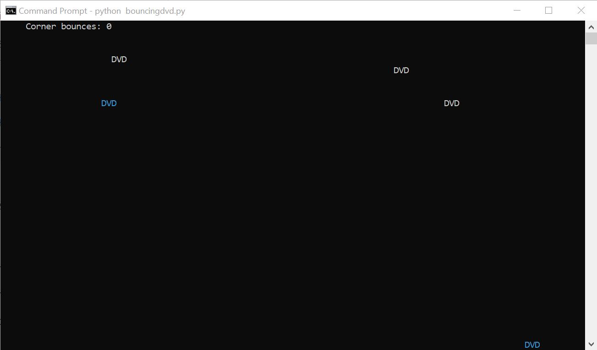
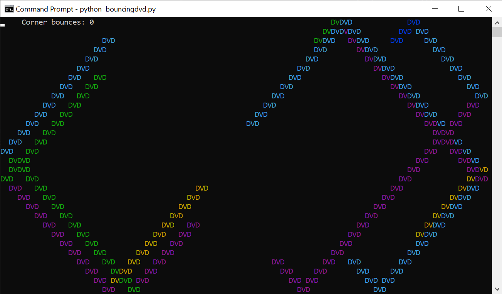

# Bouncing DVD Logo
____
_by Al Sweigart_ [al@inventwithpython.com](mailto:al@inventwithpython.com)

A bouncing DVD logo animation. You have to be "of a certain age" to appreciate this.
Press Ctrl-C to stop.

NOTE: Do not resize the terminal window while this program is running.
View the original code [here](https://nostarch.com/big-book-small-python-projects).

**Tags**: _short_, _artistic_, _bext_
____

## TODO List:

* [x] ~~Try changing the number of logos.~~

Changing the `NUMBER_OF_LOGOS` changes the number of logos bouncing around the screen. (Who'd've guessed?)

* [x] ~~Try changing the pause amount.~~

Changing the `PAUSE_AMOUNT` changes the time interval between each loop of the program, i.e. the speed the logos move:
- Lower Number :arrow_right: Faster Bouncing
- Higher Number :arrow_right: Slower Bouncing

* [x] ~~Try changing the colors.~~

Customising the list of colors in `COLORS` limits the available colors to be randomly selected on bounce.

* [x] ~~Comment out `ln65`. What happens?~~

Commenting out that line stops the program from removing the previous logo before more setting it to its new position, 
i.e. it leaves a trail of the old logos behind it as it moves.  

* [x] ~~Change logo.~~
  * [x] ~~Allow for any length logo, i.e. remove hardcoded variables related to 'DVD'.~~

- Added `LOGO_TEXT` and removed the hardcoded `"DVD"` from the print statement easily allow for any text to be bounced.
- Added `LOGO_LENGTH` to remove the direct references to the `len()` of `"DVD"` and use the length of `LOGO_TEXT` 
instead. Also need to ensure that the `print()` on `ln65` that removes the previous logo also creates an empty size of
size `LOGO_LENGTH`.

* [ ] Figure out how to display logos across two lines.

