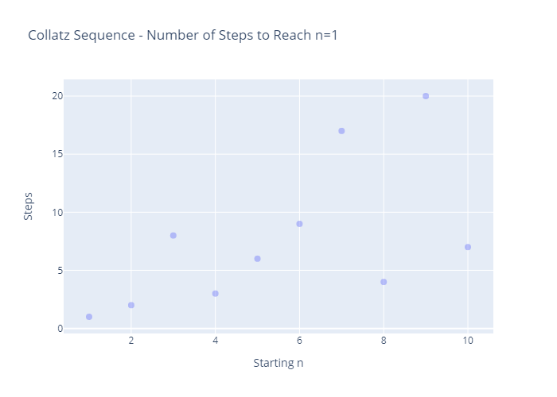
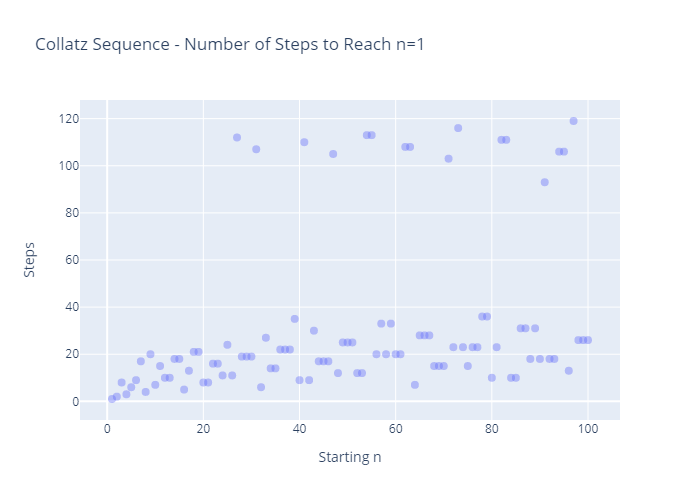
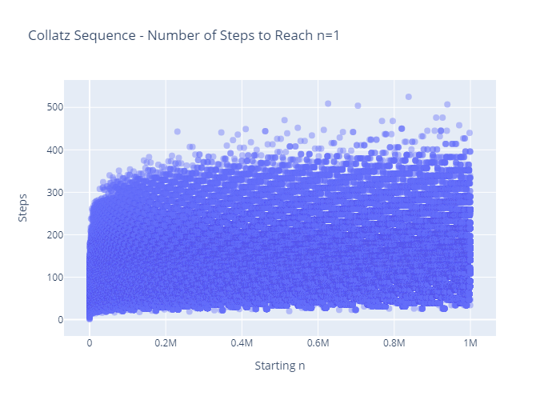

# Collatz Sequence
___
_by Al Sweigart_ [al@inventwithpython.com](mailto:al@inventwithpython.com)

Generates numbers for the Collatz sequence, given a starting number.

More info at [here](https://en.wikipedia.org/wiki/Collatz_conjecture).

View the original code [here](https://nostarch.com/big-book-small-python-projects).

**Tags**: _tiny_, _beginner_, _math_

___

## TODO List:

* [x] ~~Think of an interesting way to visualise the Collatz Sequence.~~

There are a lot of [interesting ways to visualise the Collatz Sequence](https://www.google.com/search?q=collatz+sequence+visualisations&tbm=isch&ved=2ahUKEwj525nKjPX0AhUPsxoKHWx9BecQ2-cCegQIABAA&oq=collatz+sequence+visualisations&gs_lcp=CgNpbWcQA1CoBFioBGDKCGgAcAB4AIABTYgBlwGSAQEymAEAoAEBqgELZ3dzLXdpei1pbWfAAQE&sclient=img&ei=AOTBYfnbFY_mauz6lbgO&bih=1315&biw=1279&client=firefox-b-d#imgrc=qb0IAMDxH71_8M). I wanted to give one of them a go, so I plugged the numbers generated from the sequence into a Plotly scatter plot:

It's interesting to note the patterns and differences that occur in the sequence. For example, _n=1000_ takes a very circuitous path, taking over 100 steps and at one point reaching 9232, over 9 times the original starting _n_.

In contrast, _n=10,000_ only takes 20 steps to reach 1 and smoothly reaches 1 with few dramatic changes in _n_. 

As the sequences get closer to 1, they begin to converge. For instance, both _n_=100 and _n_=10,000 pass through _n_=88, but they arrive there from different routes (_n=10,000_ : _176/2_, _n=100_ : _3(29)+1_)

Odd numbers become even numbers through _3n+1_, while even numbers can become either even or odd through _2/n_. The sequence is "trying to find" a power of 2. The powers of 2 tend directly to 1, never hitting an odd number:

- (Collatz Sequence for 2²⁰, which only takes 20 steps to reach 1)

Other even numbers will eventually hit an odd number; the _3n+1_ function then "shifts" up, to the next path of even numbers to continue the search. You can see this clearly in _n=100_:

When you plot the number of steps it takes for any given initial _n_, it produces interesting patterns:

Up to _n=10_:

Up to _n=100_:

Up to _n=1000_:

Up to _n=10000_:

Up to _n=100000_:

Up to _n=1000000_:

In the pattern, you can clearly see that certain numbers require a significantly greater number of steps to reach 1 than their neighbouring numbers. The number of steps required doesn't necessarily increase with a greater _n_. There are many numbers < 200k that take more than 300 steps to reach 1 and conversely many numbers over 1m that can reach 1 in fewer than 100 steps (e.g. n=1048576 or 2²⁰ as seen above). 

(I'd be really interested to know more about why these numbers take so few/many steps. E.g. [27 takes 111 steps(!) to reach 1](images/collatz_sequence_n27.png)... n < 27 take no more than 20-ish steps to get to 1, then [BOOM](images/collatz_sequences_num_steps_n27.png)... how/why/what is that about?! I presume there's some interesting mathematical properties to the numbers that "shoot up out of the pack". But this is supposed to be a Python learning project, not a maths one. It'll take some time to research and understand everything going on here, and I've already gotten _waaaaaay_ too distracted excitedly thinking about all this maths as it is... :sweat_smile: Perhaps another time!)

## Still TODO:

* [ ] Figure out how to create a tree plot/network graph of the sequence

What I _had_ been trying to get working originally was a treeplot or network diagram of the sequence. There many nice implementations of this online ([such as](https://upload.wikimedia.org/wikipedia/commons/a/af/Collatz-graph-20-iterations.svg)), but I'm not overly familiar with the libraries used to plot them, and when I attempted myself, it was really complicated trying to format and style the mess of numbers and paths into a _structured_ mess. I'll play around with tree/network diagrams and come back to this later.