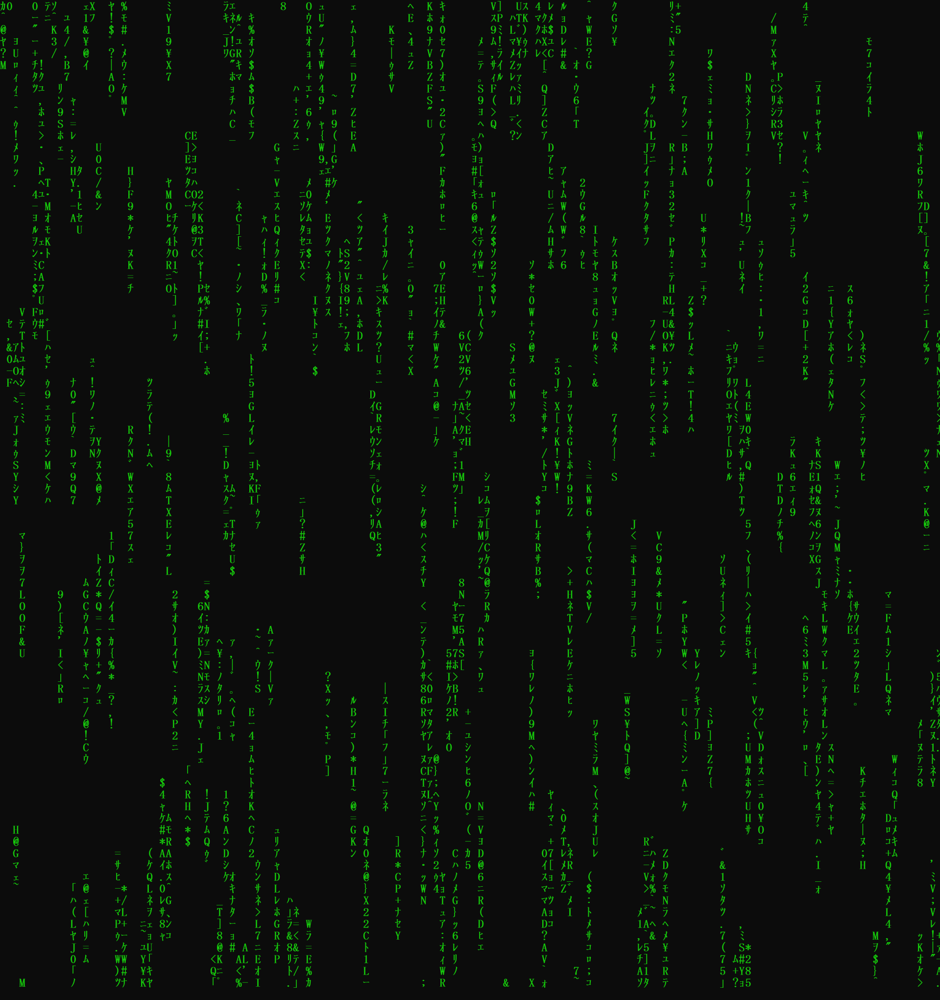

# Digital Stream
___
_by Al Sweigart_ [al@inventwithpython.com](mailto:al@inventwithpython.com)

A screensaver in the style of The Matrix movie's visuals.

View the original code [here](https://nostarch.com/big-book-small-python-projects).

**Tags**: _tiny_, _artistic_, _beginner_, _scrolling_

___

## TODO List:

* [x] ~~Change the characters used in the stream.~~

1s and 0s are fine and all, but for a program inspired by the [Matrix's "Digital Rain"](https://en.wikipedia.org/wiki/Matrix_digital_rain), why not try reproducing that as closely as possible? 

The Matrix's Digital Rain uses a mix of alphanumeric characters and halfwidth Japanese Katakana. To replicate this myself, I used the characters from the [Basic Latin](https://en.wikipedia.org/wiki/Basic_Latin_(Unicode_block)) and the [Halfwidth and Fullwidth Forms](https://en.wikipedia.org/wiki/Halfwidth_and_Fullwidth_Forms_(Unicode_block)) unicode blocks in `STREAM_CHAR`. (I only used the uppercase Latin letters, as too many letters made the stream too "legible").

The default font, Consolas, used in the Window Command Prompt does not support CJK characters, so I used MS Mincho instead. In addition, the original digital rain is green, so I changed the text colour to RGB(22, 198, 12) or #16C621 (one of the defaults).

* [ ] Mirror the characters

One feature of the original digital rain that is difficult (impossible?) to replicate is that the original characters are mirrored. (This is one of the reasons why I dropped the lowercase letters; without the mirroring it's too easy to recognise characters.)

You can't simply mirror the characters programmatically within a Python program, or certainly not within the Command Line alone. You could use _similar_ characters for some mirrored letters, e.g. using the Cyrillic Я for the Latin R, but this can only be used for a few characters and not at all for the Katakana.

You _can_ simply take images of the stream and flip them, but the more desirable goal would be to display the mirrored characters while the program runs. 

