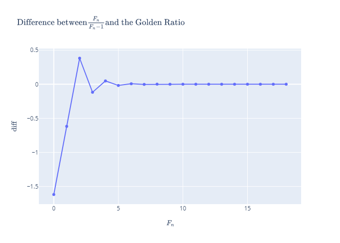

# Fibonacci
___
_by Al Sweigart_ [al@inventwithpython.com](mailto:al@inventwithpython.com)

Calculates numbers of the Fibonacci sequence: 0, 1, 1, 2, 3, 5, 8, 13...

View the original code [here](https://nostarch.com/big-book-little-python-projects)

**Tags**: _short_, _math_

___

## TODO List:

The problem with the maths-based projects is that it's very easy for me to get distracted. Once I start reading up about the particular mathematical phenomena, I will run off down the rabbit hole and end up spending hours reading about maths. Which is fine, but not why I'm working through these projects... :sweat_smile:

In any case, after reading up about the [Fibonacci Sequence](https://en.wikipedia.org/wiki/Fibonacci_number), I started looking at its relationship to the [Golden Ratio](https://en.wikipedia.org/wiki/Golden_ratio#Relationship_to_Fibonacci_sequence). For any given Fibonacci number , the ratio between it and the previous Fibonacci number, , is approximately the Golden Ratio, as  approaches , or:

The higher the , the closer the ratio is to , but it never reaches it. You can see this in the graph below show the difference between this ratio for the first 20 Fibonacci numbers and :

