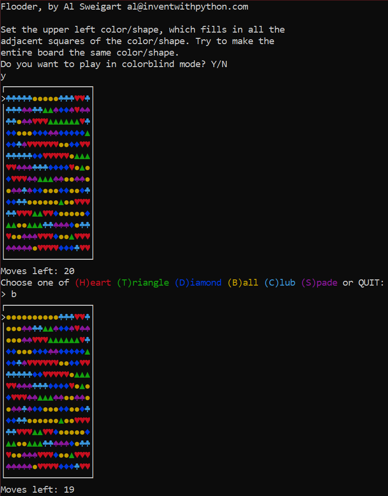
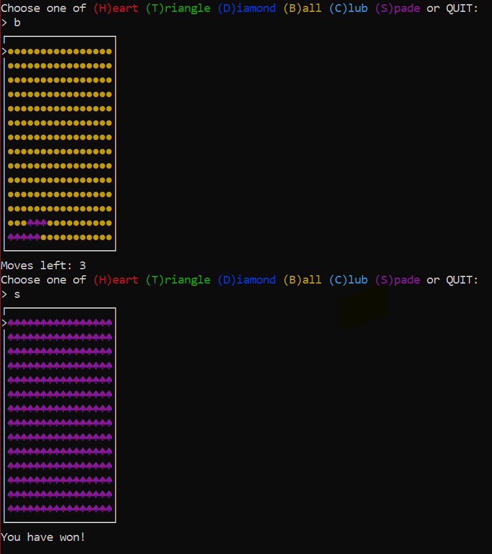

# Flooder
___
_by Al Sweigart_ [al@inventwithpython.com](mailto:al@inventwithpython.com)

A colorful game where you try to fill the board with a single color. Has a mode for colorblind players.
Inspired by the "Flood It!" Game.

View the original code [here](https://nostarch.com/big-book-small-python-projects).

**Tags**: _large_, _bext_, _game_

___

⋮

## TODO List:

* [ ] Different shapes and colors
* [ ] Different board shapse.