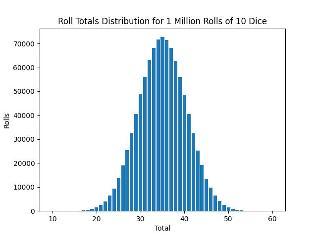

# Million Dice Roll Simulation
___
_by Al Sweigart_ [al@inventwithpython.com](mailto:al@inventwithpython.com)

A simulation of one million dice rolls.

View the original code [here](https://nostarch.com/big-book-small-python-projects).

**Tags**: _tiny_, _beginner_, _math_, _simulation_

___

## TODO List:

* [x] ~~Output Results to graph~~

I've added a tiny bit of Matplotlib, just to illustrate the distribution of the rolls:

