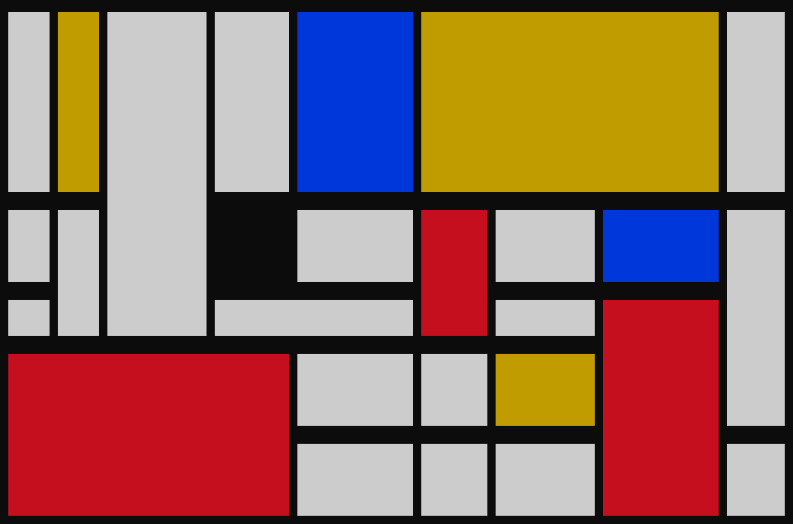

# Mondrian Art Generator
___
_by Al Sweigart_ [al@inventwithpython.com](mailto:al@inventwithpython.com)

Randomly generates art in the style of Piet Mondrian.

View the original code [here](https://nostarch.com/big-book-small-python-projects).

**Tags**: _large_, _artistic_, _bext_

___

## TODO List:

* [ ] Create programs with different color palettes.
* [ ] Use the Pillow module to produce image files of Mondrian art. You can learn about this module from Chapter 19 of Automate the Boring Stuff with Python at https://automatetheboringstuff.com/2e/chapter19/.
